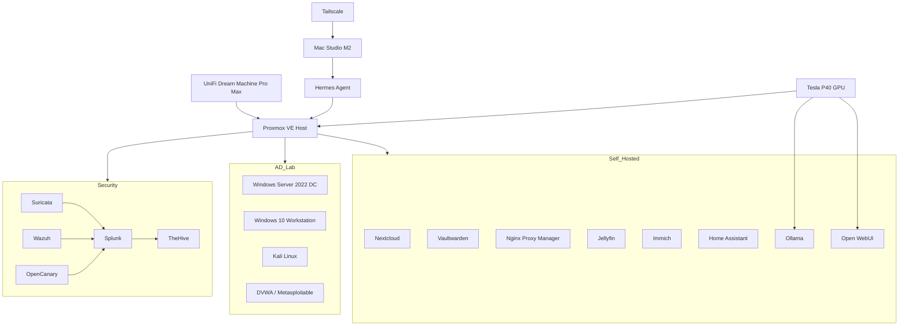

# 💀 Project Deathstar

A hands-on home cybersecurity lab built to develop real-world skills in infrastructure, monitoring, Active Directory, segmentation, self-hosting, and local AI.

Project Deathstar is my personal cyber lab and portfolio environment. I built it to move beyond theory and gain practical experience designing, securing, monitoring, troubleshooting, and documenting systems in a controlled setting.

---

## Snapshot

- Enterprise-style Proxmox VE lab
- 10 VLAN segmented network
- Blue-team and SOC-focused tooling
- Active Directory practice environment
- Honeypot and controlled attack lab
- Self-hosted internal services
- Tesla P40 GPU for local AI inference
- Managed from a Mac Studio M2 with Hermes Agent support

---

## Why This Project Exists

I built Project Deathstar to practice the skills expected in junior cybersecurity and SOC roles by working directly with the kinds of systems, tools, and workflows used in real environments.

This lab helps me build experience with:

- infrastructure and systems administration
- network segmentation and trust boundaries
- centralized logging and alert visibility
- Windows and Linux operations
- Active Directory fundamentals
- safe attack simulation
- technical documentation and reproducible builds

---

## What This Project Demonstrates

### Security and Infrastructure Skills
- Proxmox VE administration
- Linux system deployment and management
- VLAN design and network segmentation
- firewall and access-control concepts
- storage and virtualization fundamentals
- remote administration and homelab operations

### Cybersecurity Skills
- SIEM workflow fundamentals
- intrusion detection concepts
- host monitoring and file integrity visibility
- deception and honeypot alerting
- Active Directory administration practice
- attack-path and attacker-behavior awareness
- defensive validation in isolated environments

### Professional Skills
- troubleshooting
- architecture planning
- documentation
- repeatable lab design
- continuous learning through hands-on implementation

---

## Technologies Used

`Proxmox VE` `Linux` `UniFi` `VLANs` `Splunk` `Suricata` `Wazuh` `TheHive` `OpenCanary` `Windows Server` `Active Directory` `Kali Linux` `Tailscale` `ZFS` `VFIO` `Ollama` `Open WebUI` `Docker` `Home Assistant`

---

## Lab Architecture

The environment is centered on a Proxmox VE host running virtual machines and containers across isolated VLANs. Each zone is separated by function to better model enterprise-style trust boundaries and reduce risk between systems.

### Major Lab Zones
- Management
- Security monitoring
- Active Directory
- Offensive testing
- Honeypot/deception
- Self-hosted services
- IoT
- Guest access
- VPN-routed traffic

---

## Core Infrastructure

| Component | Specification |
|---|---|
| Host | Supermicro H11SSL-i Rev 2.0 |
| CPU | AMD EPYC 7532 (32c / 64t) |
| RAM | 256GB ECC |
| Storage | 256GB NVMe + 4TB ZFS mirror |
| GPU | NVIDIA Tesla P40 24GB |
| Router | UniFi Dream Machine Pro Max |
| Admin workstation | Mac Studio M2 / 32GB RAM / 512GB SSD |

---

## Security Stack

The security side of the lab is designed to provide visibility across network activity, host activity, and deception-based alerts.

### Core Components
- Suricata — network intrusion detection
- Splunk — centralized logging, search, dashboards, and alerting
- Wazuh — host monitoring and file integrity visibility
- OpenCanary — deception-based alerting
- TheHive — case management and incident workflow exposure

### Security Focus Areas
- alert review
- log investigation
- telemetry correlation
- host and network visibility
- defensive validation
- incident workflow practice

---

## Active Directory and Attack Lab

A dedicated AD environment supports both administration practice and controlled attack simulation.

### AD Lab
- Windows Server 2022
- Windows 10 workstation
- domain administration concepts
- GPO fundamentals
- user and group management

### Attack Lab
- Kali Linux
- DVWA
- Metasploitable

### Learning Focus
- attacker behavior
- enumeration concepts
- credential attack fundamentals
- detection validation
- safe offensive testing in isolated segments

---

## Self-Hosted Services

Project Deathstar also functions as a practical self-hosting platform for day-to-day infrastructure services.

### Services
- Nextcloud
- Vaultwarden
- Nginx Proxy Manager
- Jellyfin
- Immich
- Home Assistant
- Ollama
- Open WebUI

---

## Management and Automation

The operator side of the lab runs from a Mac Studio M2 and includes Hermes Agent as a planning, documentation, troubleshooting, and automation assistant.

### Management Layer
- Mac Studio M2
- Hermes Agent
- Tailscale
- UniFi management console

### Hermes Agent Use Cases
- architecture planning
- script generation
- troubleshooting support
- lab documentation maintenance
- service tracking
- workflow assistance

---

## Architecture Diagram

---

## Documentation

This repository includes build and reference guides for:

- Proxmox VLAN setup
- VM and LXC inventory
- security stack deployment
- Active Directory and attack lab setup
- self-hosted services
- Tesla P40 passthrough and AI stack
- TheHive CT104 Proxmox deployment

---

## Why It Matters

Project Deathstar represents how I approach learning and technical growth:

- build real systems
- secure them intentionally
- monitor them effectively
- test them safely
- document everything clearly

This lab is part of my path toward junior cybersecurity work, especially in blue-team, SOC, and infrastructure-focused roles.

---

## License

MIT — use freely, attribution appreciated.
